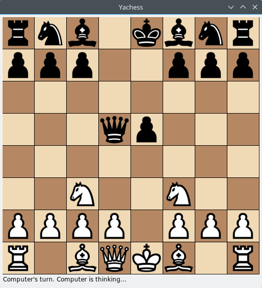

# Yachess: Yet Another Chess (AI)

Yachess is a simple chess game with AI inspired by this Medium article: [A step-by-step guide to building a simple chess AI](https://medium.freecodecamp.com/simple-chess-ai-step-by-step-1d55a9266977).

This project is entirely for fun and learning the basics of AI such as minimax, alpha-beta pruning, etc.

### Prerequisites

1. python3
   - **Linux**: https://docs.python.org/3/using/unix.html#getting-and-installing-the-latest-version-of-python
   - **Windows**: https://docs.python.org/3/using/windows.html#installing-python
   - **Mac**: https://docs.python.org/3/using/mac.html#getting-and-installing-macpython

2. pip3

   https://pip.pypa.io/en/stable/installing/

3. tkinter

   https://tkinter.unpythonic.net/wiki/How_to_install_Tkinter

### How to Play

To play, simply do the following from project root, assuming python3, pip3, and tkinter are already installed:

1. `git clone https://github.com/devinalvaro/yachess`
2. `cd yachess`
3. `make` (install python-chess with pip3)
4. `python3 src/game.py`

### Todos

 - smarter AI:
   - move-ordering
   - faster move-generation
   - end-game evaluation
   - state-caching &#10003;
   - opening book &#10003;
 - GUI:
   - log message &#10003;
   - promotion &#10003;
   - move highlight &#10003;
   - win condition &#10003;

### License

This project is licensed under the MIT License - see the LICENSE file for details
